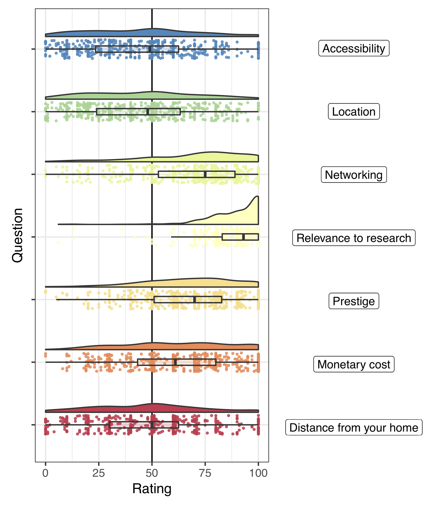
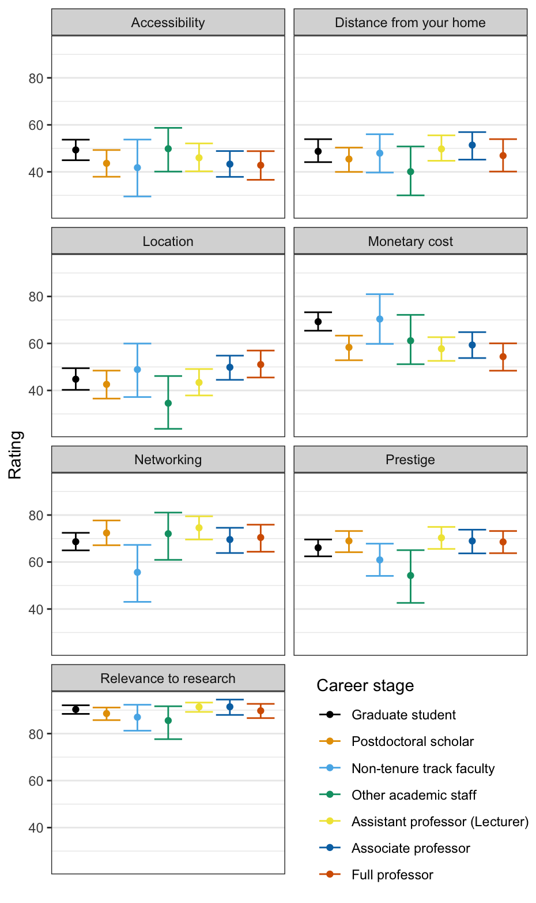
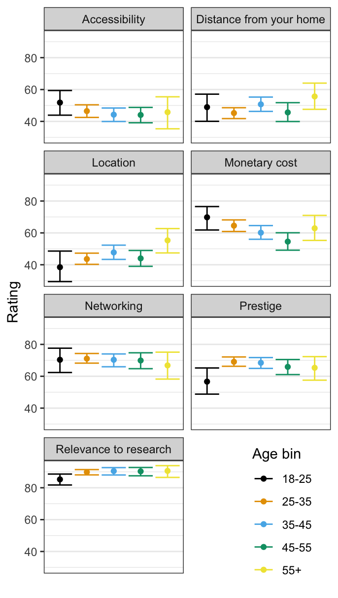

# Influence of different factors on conference attendance

## Method: Survey phrasing
We specifically asked participants to explain to us on a scale from 1-100, how much each factor contributes to their willingness to attend conferences. As with all of our rating questions, the slider was positioned at the midpoint (50).

> Q9: Which of these factors is important to you when deciding whether to attend a conference, assuming an in-person conference format?

> 1. Diversity and accessibility of conference
> 2. Desirability of location
> 3. Opportunities for networking/socializing
> 4. Relevance to your research
> 5. Prominence/prestige of conference
> 6. Monetary cost (for travel, lodging & registration)
> 7. Distance from your home

## What do cognitive scientists care about overall?

| *Figure 1: Overall importance of factors*             |
|:-------------------------:|
|{:width="550px"} |

Overall, cognitive scientists care more about networking than accessibility or attending conferences at "destination" locations. Overall, factors such as distance and monetary cost of attendance are less strong predictors across all levels of seniority. The importance of accessibility to those we surveyed was surprisingly low, showing how concerns about accessibility are not generally prominent among those who do not have accessibility concerns. 

Relevance to research is consistently the highest rated factor. The field should consider how to enhance the relevance of conferences for attendees, particularly if they are large international conferences representing diverse research areas.

---

## How do these attitudes differ by career stage?

| *Figure 2: Breakdown by career stage* |
|:-------------------------:|
| {:height="750px"} | 
| NB: Response categories with fewer than 3 observations (Undergraduate student) were excluded from this analysis. |

Researchers at different levels of seniority in cognitive science have different associated costs. Graduate students and other academics whose travel may or may not be funded by grants or department prizes (including non-tenure track faculty and non-postdoctoral academic staff), are especially concerned about the cost of a conference in registration fees, transit fees, and lodging. Monetary concerns decrease with seniority, with the exception of postdoctoral researchers, whose work is commonly supported by grants and fellowships that include research travel funding. 

We also point out a "tenure cliff" at the Associate and Full professor levels. The most senior researchers are the most interested in conferences being held at interesting locations while also being the least concerned about distance, prestige, and networking.

---

## How do these attitudes differ by age?

|*Figure 3: Breakdown by age* |
|:-------------------------:|
|{:width="450px"}|

It is clear that at least some of the seniority differences in Figure 3 are driven in part by age differences, with younger individuals typically caring more about issues such as accessibility and cost, and with older individuals caring more about the desirability of a conference (e.g. "destination" conferences). However, for many work-related topics, such as the stated goal of conferences advancing attendees' careers, factors such as _networking_, _prestige_, and _relevance to research_ are all roughly constant across age groups.

## Conclusions

Overall, some generational preferences for different types of conferences and the awareness and importance of accessibility among cognitive scientists are areas that still see need for improvement. One of the important goals of incorporating a virtual component (or satellite, or hybrid) into modern conferencing is to increase accessibility. Making this a priority to the same extent as climate change mitigation for cognitive scientists is a major obstacle that impedes progress toward fair and equitable conferencing.