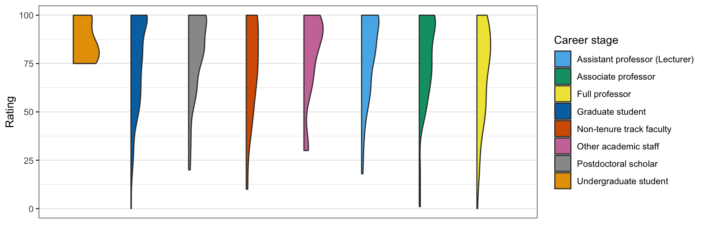
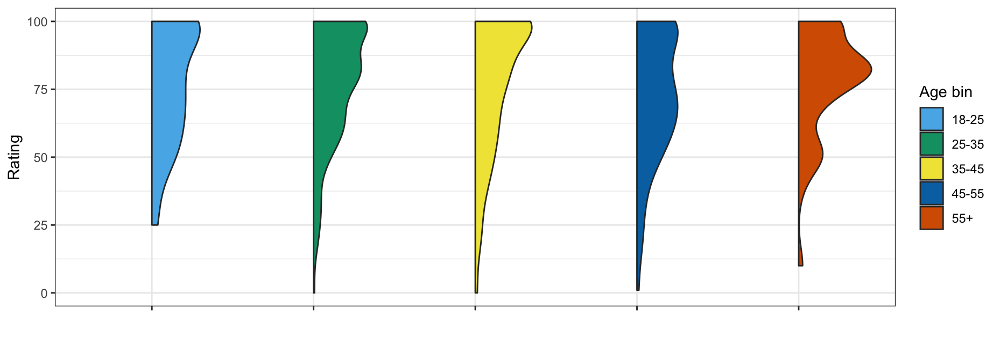
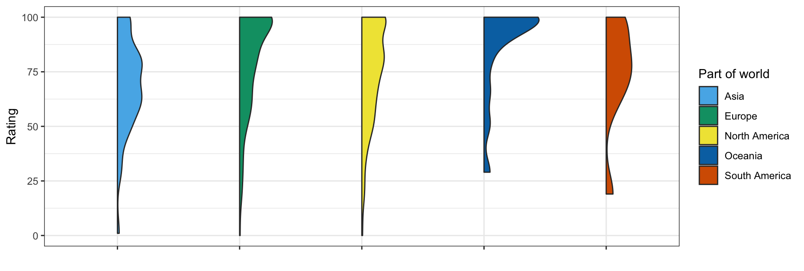

# Belief in value of moving toward sustainability 

## Method: Survey phrasing

Having the field on board with making conferences more sustainable and inclusive is in part a cultural question. How much is the Cognitive Science community willing to act to make changes? To assess whether the field is positively inclined toward curtailing the effects of climate change via administrative solutions, we asked:

> How much do you agree or disagree with the following statement:  Academics should enact policies that would reduce the negative environmental  impact of conference travel.

## Do we need to act? Absolutely.

| *Figure 1: Willingness for academics to enact change, by career stage* |
|:-------------------------:|
|{:width="600px"}|

| *Figure 2: Willingness for academics to enact change, by age* |
|:-------------------------:|
|{:width="600px"}|

| *Figure 3: Willingness for academics to enact change, by part of world* |
|:-------------------------:|
|{:width="600px"}|

## Conclusion

While there are some clear differences across some subgroups, with North Americans feeling less inclined to make concrete changes at the level of the administration, nearly every single person rated this question above the threshold of 50. The desire for change is consistent across all levels of seniority, age ranges, and across the world. We take these results to show that if organizations make changes to improve the sustainability of conferencing, their members will support these actions.