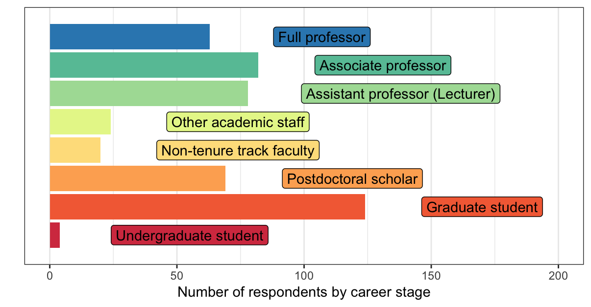
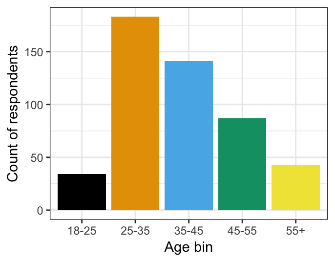
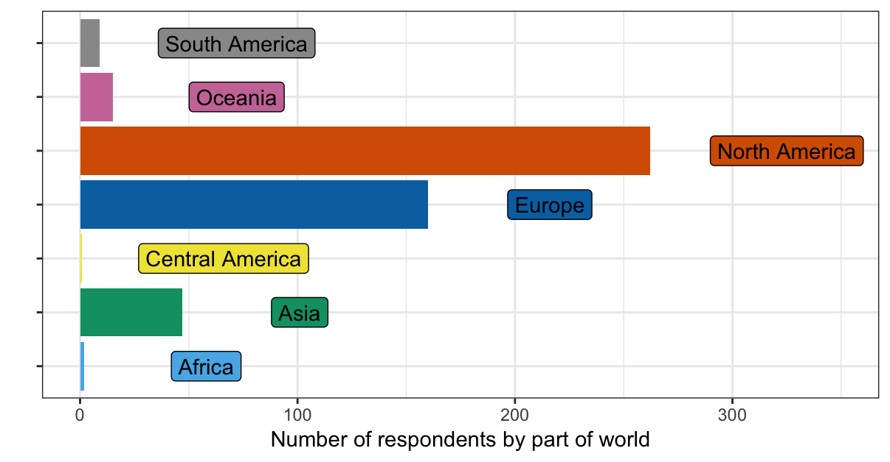
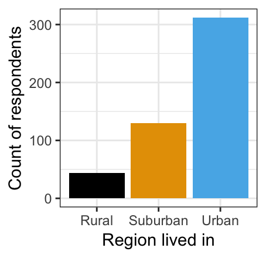

# Demographics of survey respondents

## Method: Survey phrasing

For the demographic surveys, we phrased our questions as below:

> * Q2: How old are you?
> 	* 18-25, 25-35, 35-45, 45-55, 55+
> * Q3: At what stage are you in your academic career?
> 	* Undergraduate student
> 	* Graduate student
> 	* Postdoctoral scholar
> 	* Non-tenure track faculty
> 	* Other academic staff
> 	* Assistant professor (Lecturer)
> 	* Associate professor
> 	* Full professor
> * Are you a member of a minoritized group (e.g. gender, sexual, racial, ethnic)?
> 	* Yes, No
> * Q23: Do you face barriers to online conference attendance (e.g. childcare, internet connection speed, etc.)?
> * Q14: What part of the world do you live in?
> 	* North America
> 	* Central America
> 	* South America
> 	* Europe
> 	* Africa
> 	* Asia
> 	* Oceania
> * Q5: What type of region do you live in?
> 	* Rural, Suburban, Urban

In this document we focus on the broad categories of age, career stage, region in the world, and geographic region for simplicity.

## Did we gather a wide sample of academics by seniority and title?

| *Figure 1: Distribution of seniority levels*|
|:-------------------------:|
|{:width="600px"}|

| *Figure 2: Distribution of ages* |
|:-------------------------:|
|{:width="400px"}|

Our participants were typically young, as expected when many of those surveyed self-identified as graduate students, postdoctoral researchers, or early stage faculty. Very few respondents were below the age of 25 and a similar number were above 55, which likely represents a fair sample given that our respondents were recruited largely from conference-specific mailing lists.

## Where are our respondents from?

| *Figure 3: Distribution of geographic regions* |
|:-------------------------:|
|{:width="600px"}|

Because we surveyed mostly international mailing lists with strong North American and European participation, it is unsurprising that the majority of survey participants were from these areas. While we made some effort to survey more broadly, we also think these data highlight how inaccessible American and European conferences can be to audiences outside these regions. A more equitable cognitive science that effectively leverages virtual formats can engage in people across the globe, enabling North American and European audiences to learn from active researchers who cannot typically join conferences like Cognitive Science, AMLaP, etc., and vice versa.

## Do our respondents live in rural, suburban, or urban areas?

| *Figure 4: Distribution of region inhabited* |
|:-------------------------:|
|{:width="350px"}|

In keeping with global patterns, the vast majority of survey respondents live in urban or suburban areas. 