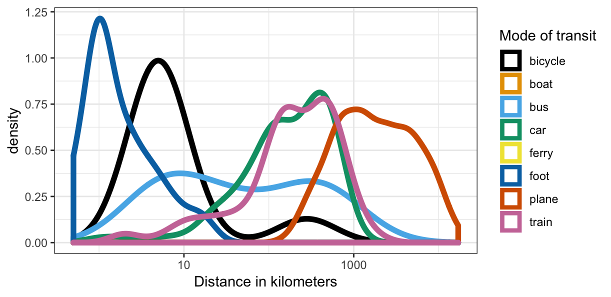
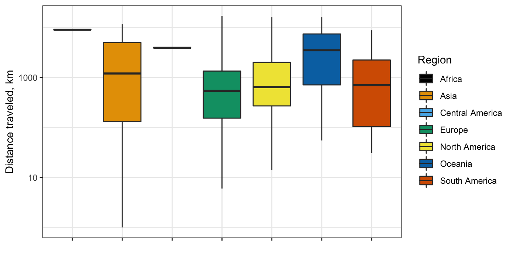
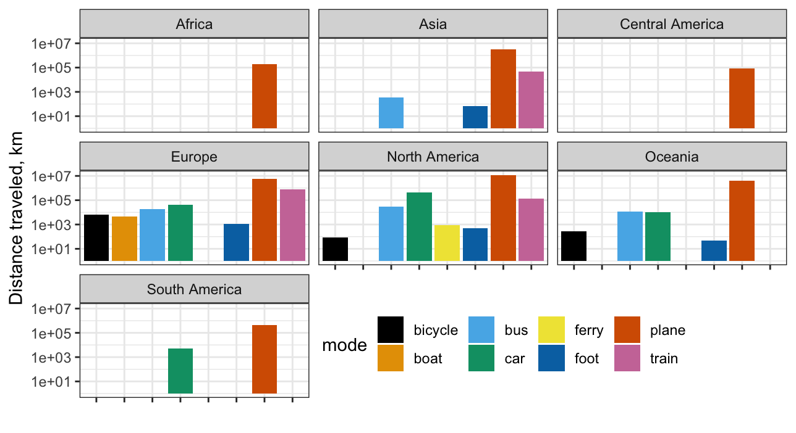
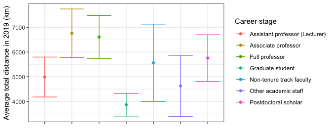
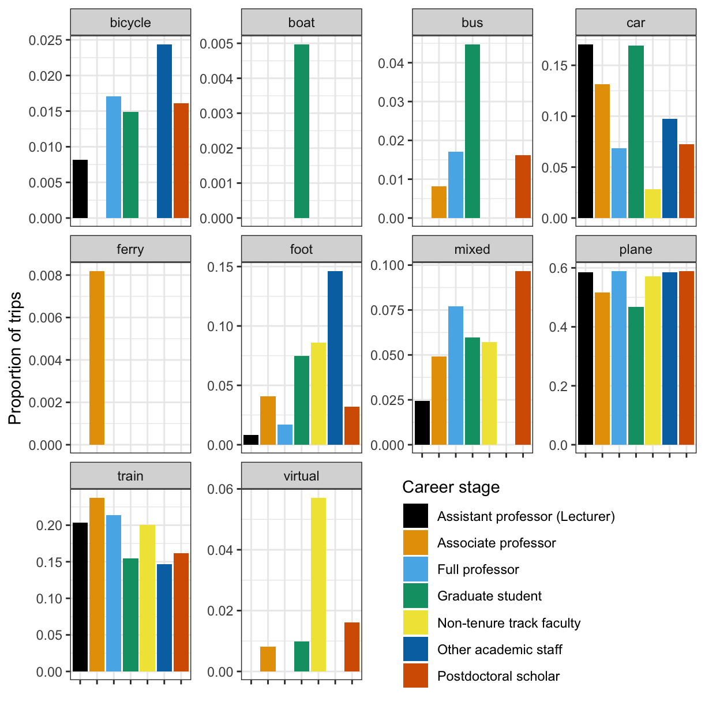

# Distances traveled

## Method: Survey phrasing
Q16: Asking participants about their distances traveled for each trip. We specifically asked:

> For each conference/workshop in 2019, indicate the distance (in either miles or km) that you traveled and your mode of transit. e.g.: Conference 1: 500 (train). The next question will ask you to specify the units (kilometers or miles)  If you attended any conferences virtually, please include them and include "0 (online)".  You may find the following calculator useful: [https://www.distancecalculator.net/](https://www.distancecalculator.net/)  
> 
You may skip this question if you are pressed for time.

Answers were manually corrected to parse distances, travel modalities, and remove and verify units (km or miles). Participants who did not state the mode(s) of transportation for a given trip were assigned an "unknown" mode. When participants indicated mixed transit (e.g. bus and rail), we used the total distance to infer a best guess for the mode associated with the greatest distance. None of our analyses hinge on these estimated data; we always assess distances using the most explicit mode. When participants specified distances for each of multiple modes, additional records were created in the spreadsheet; thus, the number of records in the distances dataset does not exactly match the number of records in the raw data.


## How far are we going and how?

The mode of transport that our respondents used depended strongly on the distances that they decided to travel, as seen below in Figure 1. For long trips, air travel was predictably the most frequent, while the shortest trips took place by foot. Train and car travel typically ranged the same distances, though it is worth noting that many of the longer train trips were taken by participants in Europe, where an extensive international network of train transport exists (see Figure 2). We wish to note that with increasing distance also comes increasing carbon cost. The longest trips are flights, which are the most carbon-intensive form of transit we surveyed. We note, however, that some long distances are traveled by at least one brave respondent, who journeyed 300 kilometers for one segment of their trip by bicycle.


| Figure 1: Distances traveled by modality | 
| --- | 
|  |


## Are there differences in transit across regions?

Colleagues wishing to attend a conference in Europe or North America, where the majority of respondents live, have a different transit footprint that those living in other parts of the world. As can be seen in Figure 2A, respondents in Oceania travel much greater distances to attend a conference in Europe or North America than almost any other group. Respondents from Brazil, Argentina, and South Africa must also travel great distances, though we note that the data here are sparse. However, it is critical that the field engage researchers from across the world and understand whether and how their needs are currently being served.


| Figure 2A: Distances by region |
| --- |
|  | 

Given the differences in transit network connectivity and infrastructure across the world, we sought to understand how survey participants traveled. While plane travel was the dominant mode across the globe, we note that the distances traveled by European respondents also represented substantial train, bicycle, and boat travel that is absent among North American respondents.

| Figure 2B: Modality by region |
| --- |
|  |


## Were respondents at different career stages using different modes of transportation to conferences?

Young people have more positive feelings toward public transit and use it more frequently; they more strongly believe in the catastrophic effects of climate change; and they are the future of academia. At the same time, young researchers, especially graduate students, have greater financial constraints, both based on their personal and due to funding restrictions at the university level. Therefore, differences between  the transportation habits of different academic career stages can be informative about actionable change within cognitive science.

Figure 3A shows the relationship between distances traveled by different career stages. We aggregated all miles traveled by all of our respondents. It is clear that on average, associate professors and full professors travel the greatest distance per year, while graduate students travel the shortest distances on average. This is largely explained by the difference in unique trips taken by the different groups, with full professors also attending the greatest number of conferences per year:

```
  Seniority                      Unique Trips Mean Number of Trips
1 Assistant professor (Lecturer)          186                 2.35
2 Associate professor                     212                 2.62
3 Full professor                          200                 2.74 ***
4 Graduate student                        309                 2.36
5 Non-tenure track faculty                 52                 2.48
6 Other academic staff                     49                 1.96
7 Postdoctoral scholar                    186                 2.55
8 Undergraduate student                    11                 2.75
```


| Figure 3A: Distance by career stage | 
| ------------------------- |
|  |
| <small>NB: Response categories with fewer than 3 observations (Undergraduate student) were excluded from this analysis.</small> |


Figure 3B likewise shows the different modes of transportation that the respondents used. While every group traveled extensively by plane, with only graduate students at approximately 40% of trips being air travel, the trips taken by graduate students are also more variable; they travel by bike, boat, bus, on foot, by train, and a mixture of modes. Notably, the category of other academic staff typically attended conferences that they could bike, walk, or drive to. Non-tenure track faculty, who are often in precarious positions with no travel funding were also the most likely group to participate in virtual conferences. Better understanding how to make more local conferences more effective and making all conferences easier to attend has especially promising potential for those who are least flush with cash and time.


| Figure 3B: Modality by career stage |
| --- |
|  |
| <small>NB: Response categories with fewer than 3 observations (Undergraduate student) were excluded from this analysis.</small> |


## Conclusions

It is clear that researchers from different parts of the world and at different stages in their careers are variable in their willingness to travel very long distances and spend long amounts of time in transit. Researchers optimize the modality based on the distances they travel (Figure 1), but great distances are nevertheless traveled by all demographic groups. Even graduate students, who are one of the most cash-strapped demographics, nevertheless attended over two conferences on average and traveled approximately 4000 kilometers in 2019 (Figure 3A). The ways that conference attendees arrived at their destinations were somewhat variable across career stages but all groups nevertheless primarily flew to conferences (Figure 3B). There is significant data sparsity from some parts of the world, showing that the cognitive science community should consider conducting greater outreach to serve researchers outside Europe and North America. 

Finally, the most senior members of the community create the greatest amount of emissions by far (Figure 3A), attending the most conferences and traveling the greatest total distance of any group. We note however that this same demographic also rated the possibility of "Fewer conferences" much higher than other demographics (see the breakdown of different [solutions](solutions.md)). We propose that this group closely reevaluate their conference attendance.
