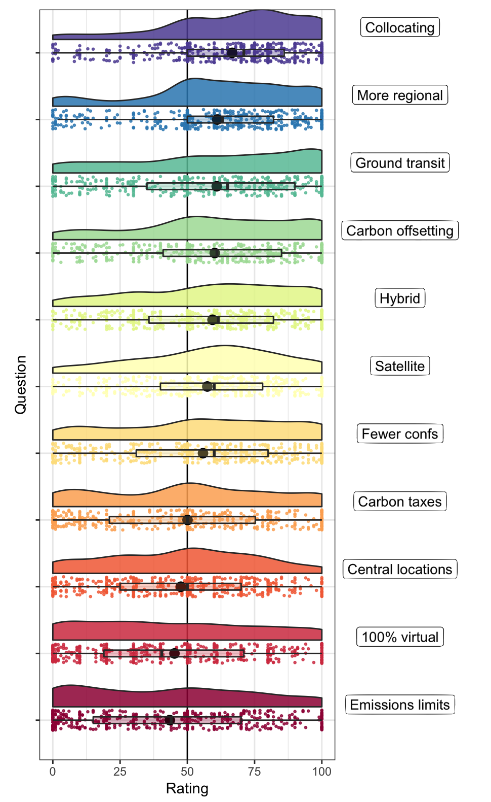
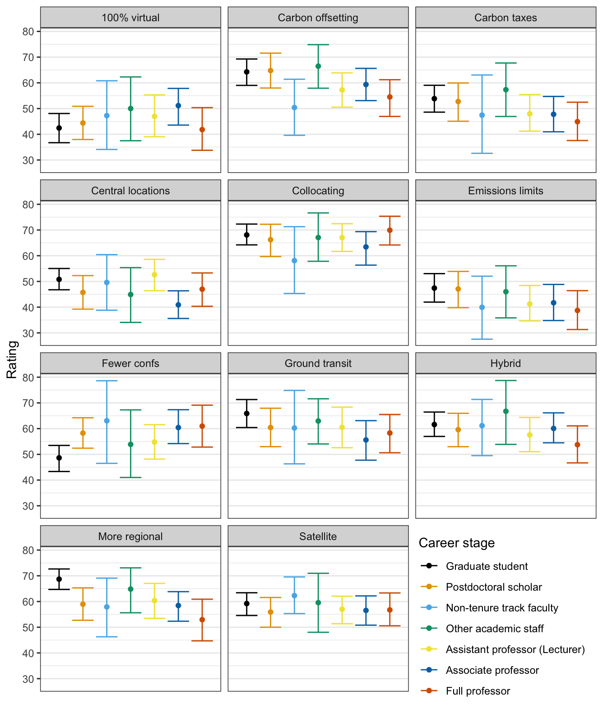
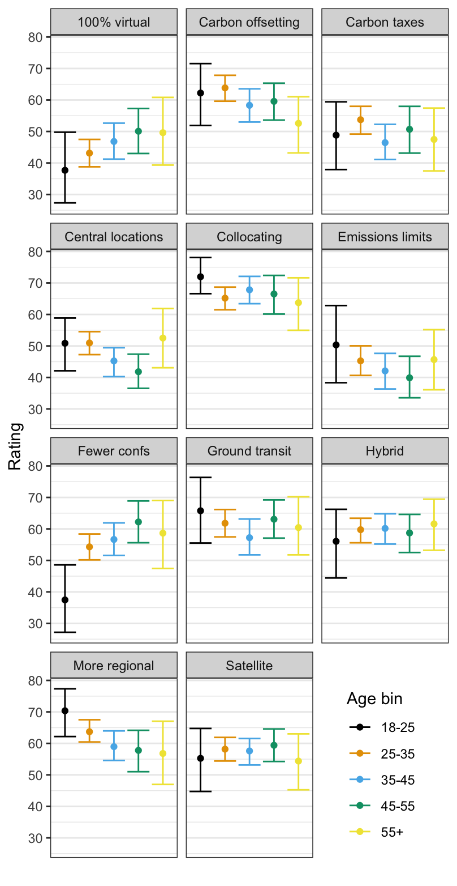
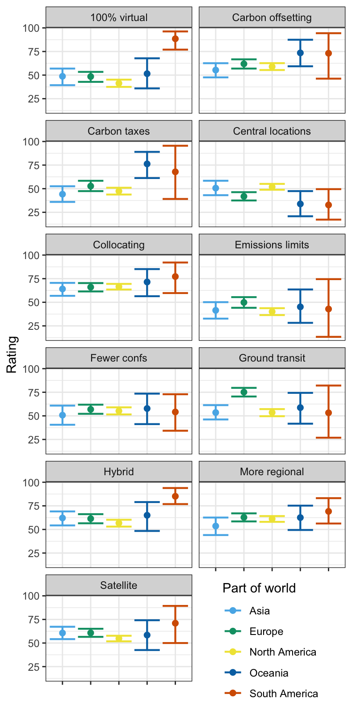

# Attitudes toward different solutions

## Method: Survey phrasing

Because one of the primary goals of this work is to advance accessibility and sustainability together, we first asked participants about their attitudes toward different potential actions that could be taken to promote more sustainable conferencing. Participants rated their relative positivity/negativity toward each solution on a scale from 1-100, with the midpoint starting at 50.

> **Q12: How do you feel about the following proposed ways of making conferences more environmentally sustainable?**
>
> * Converting standard conferences to 100% virtual attendance                                                                                                                                                                                                                                                                                                                       
> * Converting standard conferences to blend of in-person and virtual attendance (e.g. 30/70 or 20/80)
> * Converting standard conferences to a satellite model (decentralized meetings occur at the same time, e.g. one in Central Europe and another in Asia that are linked via video conferencing)
> * Requirement for carbon offsetting of travel (from e.g. funding agency, university, or professional society)
> * Changing locations of in-person conferences to highly central locations (e.g. London, New York vs. Cardiff, Buffalo)
> * Universities instituting emissions limits (e.g. per person or department, factoring in seniority, location, etc.)
> * University policy changes to require ground transit (train, bus, car) for shorter distances (e.g. < 300 mi)
> * Universities instituting carbon taxes
> * Collocating smaller conferences with larger conferences (e.g. a meeting at the same time/place as CogSci, Psychonomic Society)
> * Reduction in the number of conferences
> * Incentivizing attendance of regional conferences

## Global popularity of more efficient conferencing

| *Figure 1: Overall attitudes*             |
:-------------------------:|
|{:height="700px"}|

Respondents were overall most positive toward solutions that incentivized a similar number of conferences to reduce carbon footprints. For example, collocating smaller conferences with larger ones was one of the most popular options. This option has the added benefit that smaller, more tailored workshops with higher relevance to individual researchers' work can be held in the same location as large, community-wide conferences. Respondents also favored more regional conferences, satellite formats (regional versions of large conferences), and hybrid virtual and in-person formats. Additionally, participants supported encouraging the use of ground transit when it is more efficient than air travel (short distances). 

Respondents did not typically approve of explicit tariffs or fees to disincentivize conference attendance, nor did they approve of universities setting policies or limits on consumption. 

---

## Generational and seniority-based differences

| *Figure 2: Attitudes by seniority*             |
:-------------------------:|
| {:width="600px"}|
| NB: Undergraduate students were excluded from this analysis due to the low numbers of observations from this group.|

| *Figure 3: Attitudes by age bin*             |
:-------------------------:|
| {:width="500px"}|

The youngest respondents were the least enthusiastic about limiting the number of conferences, potentially because of the loss of networking opportunities. Younger respondents were typically more positive on average toward taking direct action in the form of carbon offsets and carbon taxes, and were the most positive group for collocating smaller conferences with larger ones. Younger participants were more positive about regional conferences. Across all age ranges, emissions limits and the reduction in the number of conferences were roughly equally unpopular. 

Older participants were in general more likely to be positive toward cutting the number of conferences overall. 

---

## Regional differences

| *Figure 4: Attitudes by region* |
|:-------------------------:|
| {:width="500px"}|
| NB: We excluded respondents from Africa and Central America due to low numbers of responses from this group.|

Incentivizing greener trips was a more popular class of option in Europe (e.g. ground transit, especially trains). Somewhat surprisingly, virtual conferences more popular outside North America, and respondents from South America and Oceania were especially positive toward improving the efficiency of conferencing by collocating conferences and by making them 100% virtual, underscoring how air travel can be prohibitively expensive or result in long journeys for trips across the equator.
